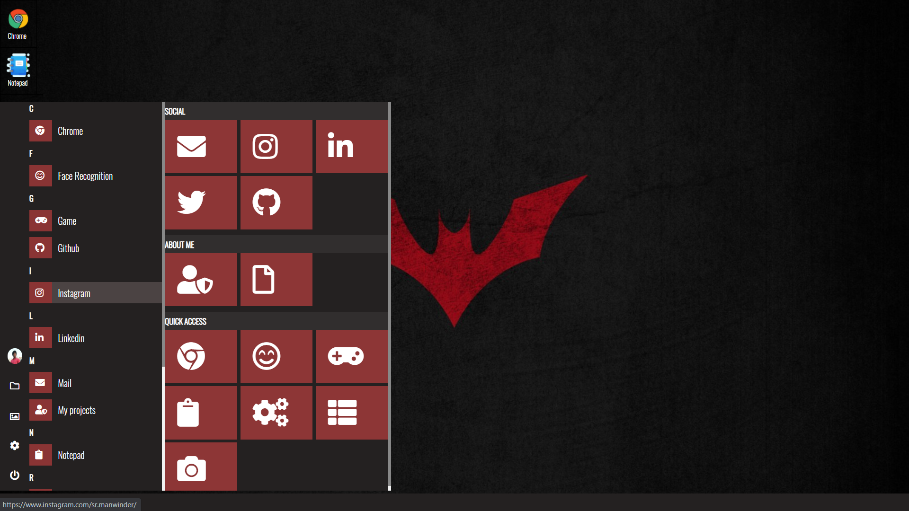

# portfolio.os

Hey there Peeps!! 
This is something interseting i made. This is an operating system web app cum my portfolio. 
Thats why i named it portfolio.os  
This is just simple html , css and javascript. 
If you want to , you can understand this code as i have maintained it very wisely and used comments for you to understand. 
In case you cant login use password to be "1234" 
This link to my portfolio.os is :-https://manwindersingh1712.github.io/portfolio.os/
  
Few snapshots of this are been uploaded here below , there are many more features in it rather than just the snaps as given. 
Do try using all the features. 

